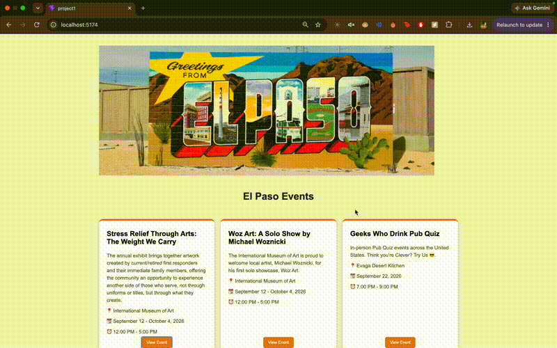

# *El Paso Events*

Submitted by: **Ana Paulina Calderon**

**El Paso Events** is a community board that helps people in El Paso discover local events and activities. The website displays upcoming events with information about each event and links to learn more.

Time spent: **10** hours spent in total

## Required Features

The following **required** functionality is completed:

* [x] The app has a cohesive, unique theme for events or resources relevant to a specific community

  * [x] Header/title describing the theme is displayed
* [x] At least 10 unique events or resources are displayed in a responsive card format

  * [x] There are at least 10 cards displayed for 10 different events
  * [x] The cards are displayed in an organized format using a grid
  * [x] Each card includes information about the event, including its name, description, location, date, and time

The following **optional** features are implemented:

* [x] Buttons or links to related resources are on each card component
* [x] The site is responsive for both desktop and mobile formats

## The following **additional** features are implemented:

* [x] Added hover effects to event cards and buttons to make the interface more interactive.

## Video Walkthrough

Here's a walkthrough of implemented features:

[Video Walkthrough](project1_walkthrough.gif)



GIF created with QuickTime Player and FFmpeg

## Notes

The main challenges I encountered were learning how to create a reusable React component and pass different event information to each card using props. I also worked on using CSS Grid to organize the event cards and make the layout work well on different screen sizes.

## License

```
Copyright [2026] [Ana Paulina Calderon]

Licensed under the Apache License, Version 2.0 (the "License");
you may not use this file except in compliance with the License.
You may obtain a copy of the License at

    http://www.apache.org/licenses/LICENSE-2.0

Unless required by applicable law or agreed to in writing, software
distributed under the License is distributed on an "AS IS" BASIS,
WITHOUT WARRANTIES OR CONDITIONS OF ANY KIND, either express or implied.
See the License for the specific language governing permissions and
limitations under the License.
```

